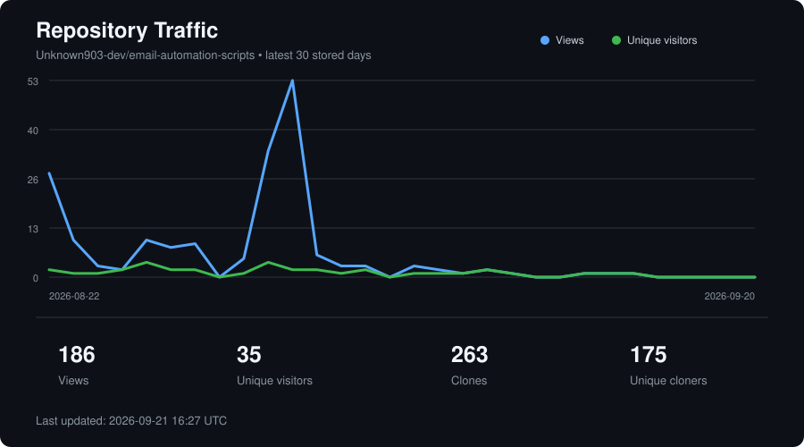

## Repository Traffic



# Go to
Head over to [canvas-api-invite/readme.md](https://github.com/Unknown903-dev/email-automation-scripts/blob/main/canvas-api-invite/README.md) to see how to use it

# Student Community Invite Automation

A Python automation project for helping students connect with course-based online communities more efficiently.

The project originally began as a desktop automation experiment that used mouse movement and keyboard input to reduce the repetitive work involved in inviting students to class Discord servers and other course communities.

That prototype proved the workflow could be automated, but graphical automation introduced several limitations. It depended on browser positioning, screen resolution, cursor coordinates, zoom level, and the layout of the website remaining unchanged.

The current implementation replaces that approach with the **Canvas REST API** and introduces **QuickInvite**, a command-line tool designed to make course invitation workflows safer, more reliable, and easier to maintain.

---

## Project Purpose

Students often benefit from course-specific communities where they can:

- Ask classmates questions
- Share study resources
- Discuss assignments
- Coordinate projects
- Find study partners
- Help each other outside of scheduled class time

Creating these communities is easy.

Getting everyone invited can be repetitive.

For larger courses, manually contacting students one at a time can become slow and difficult to manage. This project was created to automate part of that workflow while still keeping important decisions—such as recipient selection, message review, and final sending—under the user's control.

The goal is not to create a general-purpose mass messaging system.

The goal is to provide a controlled tool for legitimate course and academic community communication.

---

# Current Project: QuickInvite

The primary implementation is located in:

```text
canvas-api-invite/
```

QuickInvite is a Python command-line application that communicates directly with Canvas through the Canvas REST API.

Instead of automating:

```text
Mouse
    ↓
Keyboard
    ↓
Browser
    ↓
Canvas UI
```

QuickInvite uses:

```text
QuickInvite
    ↓
Canvas API Client
    ↓
Canvas REST API
    ↓
Canvas
```

This makes the workflow significantly less dependent on the user's computer interface.

---

## Repository Structure

The current `main` branch is focused on the Canvas API implementation.

```text
email-automation-scripts/
│
├── canvas-api-invite/
│   ├── src/
│   │   └── canvas_inviter/
│   │       └── QuickInvite source code
│   │
│   ├── examples/
│   │   └── Example message and recipient files
│   │
│   ├── tests/
│   │   └── Automated tests
│   │
│   ├── main.py
│   ├── pyproject.toml
│   ├── .env.example
│   └── README.md
│
├── docs/
│   └── Repository documentation and generated assets
│
├── scripts/
│   └── Repository automation utilities
│
├── .github/
│   └── GitHub Actions and repository configuration
│
├── LICENSE
│
└── README.md
```

The original cursor/keyboard automation implementation has been removed from the current `main` branch.

It is still preserved in the historical:

```text
main-2.0
```

branch:

```text
https://github.com/Unknown903-dev/email-automation-scripts/tree/main-2.0
```

This allows the original implementation to remain available for reference without keeping obsolete automation code in the current version of the project.

---

# QuickInvite Features

QuickInvite currently supports:

- Canvas API authentication
- Canvas course discovery
- Active course-user discovery
- Student-only recipient selection by default
- Role-based recipient filtering
- Canvas Inbox messaging
- Dry-run / preview mode
- CSV-based recipient filtering
- Duplicate-message prevention
- Local send history
- Personalized message templates
- Configurable batch sizes
- Environment-based configuration
- Private Canvas token handling
- A dedicated QuickInvite CLI
- Detailed built-in help documentation
- Automated tests for important safety behavior

The design intentionally separates the command-line interface from the underlying Canvas API client.

At a high level:

```text
QuickInvite CLI
      │
      ▼
Command / recipient logic
      │
      ▼
Canvas API client
      │
      ▼
Canvas REST API
```

---

# Why the Project Changed

The original implementation used cursor positioning and keyboard automation.

Conceptually, it worked like this:

```text
Python Script
     ↓
Move Cursor
     ↓
Click Browser Elements
     ↓
Type Student Information
     ↓
Send Invitation
```

That approach worked as a prototype, but UI automation is inherently fragile.

A small change such as:

```text
Browser moved
Browser resized
Zoom changed
Website redesigned
Button moved
Page loaded slowly
Different screen resolution
```

could cause the automation to perform the wrong action or fail entirely.

The API-based implementation removes most of those dependencies.

QuickInvite instead communicates using structured requests:

```text
QuickInvite
     ↓
Canvas API request
     ↓
Course / student information
     ↓
Recipient filtering
     ↓
Message preview
     ↓
Explicit send
```

This makes the system easier to test, maintain, and understand.

---

# QuickInvite CLI

QuickInvite can be launched directly from Python:

```bash
python main.py
```

or, after installation:

```bash
quickinvite
```

Running the command without arguments displays a compact QuickInvite interface describing the available actions.

For detailed instructions:

```bash
quickinvite --help
```

or:

```bash
python main.py --help
```

The detailed help screen explains:

- Initial setup
- Course discovery
- User discovery
- Previewing messages
- Sending messages
- Recipient filtering
- Available recipient roles
- Message templates
- Environment variables
- Safety behavior
- Command options

---

# Basic Workflow

The normal QuickInvite workflow is:

```text
1. Configure Canvas
        ↓
2. Find Course
        ↓
3. View Students
        ↓
4. Prepare Message
        ↓
5. Preview
        ↓
6. Review Recipients
        ↓
7. Explicitly Send
```

---

## 1. Find a Course

QuickInvite can list the Canvas courses available to the authenticated account:

```bash
quickinvite --courses
```

Example:

```text
Canvas Courses

Course ID    Course
12345        CSE 100 - Software Engineering
67890        CSE 195 - Capstone
```

The course ID can then be used for subsequent commands.

---

## 2. View Course Users

To inspect the users available in a course:

```bash
quickinvite --users 12345
```

By default, QuickInvite targets:

```text
student
```

and only active enrollments are retrieved.

This means teachers, TAs, observers, and designers are not included in the normal student invitation workflow unless another role is explicitly selected.

---

## 3. Preview an Invitation

Before performing a real send, a message can be previewed:

```bash
quickinvite --preview \
  --course-id 12345 \
  --subject "Class Community Invite" \
  --message-file examples/sample_message.txt
```

Preview mode allows the user to review the operation before any Canvas messages are created.

```text
PREVIEW / DRY RUN

Recipients: selected
Message: rendered
Canvas send endpoint: NOT called
```

No Canvas conversation should be created during a preview.

---

## 4. Send an Invitation

A real Canvas message requires the explicit send option:

```bash
quickinvite --send \
  --course-id 12345 \
  --subject "Class Community Invite" \
  --message-file examples/sample_message.txt
```

The distinction between preview and send is intentional.

```text
--preview
    ↓
Review only
    ↓
Nothing sent


--send
    ↓
Explicit user action
    ↓
Canvas message sent
```

If there is any uncertainty about the recipients or message, preview mode should be used first.

---

# Canvas Inbox, Not SMTP Email

QuickInvite sends **Canvas Inbox conversations** through the Canvas Conversations API.

It does not directly send SMTP email and does not need to scrape student email addresses.

A student may still receive an email, push notification, or other alert if their Canvas notification settings are configured to notify them about new Canvas conversations.

The actual notification behavior is controlled by Canvas and the recipient's notification preferences.

---

# Recipient Selection

QuickInvite supports several ways to control who receives a message.

The default recipient type is:

```text
student
```

Other Canvas enrollment roles may be selected explicitly when required.

Potential roles include:

```text
student
teacher
ta
observer
designer
```

For the normal course-community invitation workflow, the default student role should generally be used.

---

## CSV Recipient Filtering

QuickInvite can further restrict a message to a selected list of recipients.

For example:

```csv
name
Jane Student
Alex Student
```

The CSV can then be supplied when previewing or sending.

This is useful when only a subset of a class should receive a particular invitation.

Depending on the information returned by Canvas, matching can use fields such as:

```text
id
name
sortable_name
login_id
email
```

CSV files containing real student information should remain private and should not be committed to this repository.

---

# Personalized Message Templates

Message files support simple user-specific placeholders.

For example:

```text
Hi {{name}},

You're invited to join our class community:

https://discord.gg/example
```

Supported placeholders include:

```text
{{id}}
{{name}}
{{sortable_name}}
{{login_id}}
{{email}}
```

When personalized placeholders are used, QuickInvite can render a message separately for each recipient using the information available from Canvas.

---

# Duplicate Prevention

QuickInvite maintains a local sent log.

The default location is:

```text
data/sent_log.csv
```

This allows the program to identify recipients who have already been contacted.

Conceptually:

```text
Canvas Users
     ↓
Recipient Filters
     ↓
Sent Log Check
     ↓
Already Sent? ── Yes ──> Skip
     │
     No
     ↓
Eligible Recipient
```

This helps reduce accidental duplicate invitations.

The sent log is local data and should not be committed to the public repository.

---

# Installation

Move into the QuickInvite project:

```bash
cd canvas-api-invite
```

Create a Python virtual environment:

```bash
python3 -m venv .venv
```

Activate it on macOS or Linux:

```bash
source .venv/bin/activate
```

Install QuickInvite in editable mode:

```bash
pip install -e .
```

You can then use:

```bash
quickinvite
```

while the virtual environment is active.

To leave the virtual environment:

```bash
deactivate
```

To return later:

```bash
source .venv/bin/activate
```

---

# Canvas Configuration

Copy the included environment template:

```bash
cp .env.example .env
```

Then configure your Canvas instance:

```env
CANVAS_BASE_URL=https://YOUR-SCHOOL.instructure.com
CANVAS_TOKEN=your_canvas_token_here
```

The `.env` file should remain local.

Do not commit it.

---

## Canvas Access Tokens

A Canvas access token gives software access to actions available to your Canvas account.

Treat the token like a password.

Do not:

```text
Commit it to GitHub
Paste it into screenshots
Share it publicly
Place it inside source code
Store it in README files
```

Depending on your institution, access-token creation may be available under:

```text
Canvas
→ Account
→ Settings
→ New Access Token
```

The exact interface and availability can vary between institutions.

Use the shortest practical expiration period for your workflow when expiration settings are available, and revoke tokens that are no longer needed.

QuickInvite cannot grant itself additional Canvas permissions.

It can only perform actions that the authenticated Canvas account is already permitted to perform.

---

# Safety Design

The current version includes safeguards intended to reduce accidental or inappropriate sends.

These include:

- Explicit send behavior
- Preview mode
- Student-only recipients by default
- Active-enrollment filtering
- Recipient CSV filtering
- Duplicate prevention
- Local send tracking
- Environment-based credential storage
- Git exclusions for sensitive files
- Automated tests around dry-run behavior

A real Canvas message should never be created merely by opening QuickInvite or displaying its help screen.

---

# Privacy

Canvas course information may include educational records or other personal information.

Canvas-derived data should remain private unless there is a legitimate and authorized reason to handle it differently.

Examples of information that should not be committed to this repository include:

```text
Student names
Canvas user IDs
Login IDs
Email addresses
Course enrollment information
Course membership information
Recipient CSV files
Message logs
Send history
Canvas access tokens
```

Local files such as:

```text
.env
data/sent_log.csv
local recipient CSV files
local message logs
```

should remain outside version control.

Before committing changes, review what Git will upload:

```bash
git status
```

Never assume that a file is ignored without checking.

---

# Responsible Use

This project is intended for legitimate academic and community communication.

It should not be used for:

- Spam
- Harassment
- Unwanted mass messaging
- Unauthorized advertising
- Scraping private student information
- Circumventing institutional policies
- Circumventing Canvas permissions
- Messaging people who would not reasonably expect the communication

Users are responsible for ensuring that their use of QuickInvite complies with their institution's rules, applicable privacy requirements, and Canvas policies.

---

# Legacy Cursor Automation

The first implementation of this project used local cursor and keyboard automation.

That prototype is important to the project's history because it demonstrated the original idea and helped identify the limitations that motivated the Canvas API rebuild.

However, it is no longer maintained as the primary implementation.

The legacy source remains available on the:

```text
main-2.0
```

branch:

```text
https://github.com/Unknown903-dev/email-automation-scripts/tree/main-2.0
```

The current branch strategy is:

```text
main
│
└── QuickInvite
    ├── Canvas REST API
    ├── CLI
    ├── Preview / dry-run
    ├── Recipient filtering
    ├── Duplicate prevention
    └── Active development


main-2.0
│
└── Legacy Prototype
    ├── Cursor automation
    ├── Keyboard automation
    └── Historical reference
```

Keeping the legacy implementation on a separate branch allows the repository to preserve the development history without mixing the obsolete approach into the current application.

---

# Project Evolution

The project can be viewed in two major generations.

### Generation 1 — UI Automation

```text
Local Python Script
        ↓
Mouse / Keyboard Automation
        ↓
Browser Interface
        ↓
Manual UI Workflow
```

Advantages:

```text
Quick prototype
Easy to experiment with
Demonstrated the automation concept
```

Limitations:

```text
Fragile cursor coordinates
Browser-layout dependency
Screen-resolution dependency
Timing problems
Difficult automated testing
Difficult long-term maintenance
```

### Generation 2 — QuickInvite

```text
QuickInvite CLI
        ↓
Structured Python Logic
        ↓
Canvas API Client
        ↓
Canvas REST API
```

Advantages:

```text
Structured API communication
Predictable inputs and outputs
Better error handling
Easier testing
No cursor coordinates
No browser automation
Recipient filtering
Duplicate protection
Dry-run safety
Cleaner architecture
```

The second implementation represents the direction of the project going forward.

---

# Development Philosophy

QuickInvite is intended to stay relatively small and understandable.

The project favors:

```text
Simple CLI
Clear commands
Minimal dependencies
Safe defaults
Explicit sends
Separated business logic
Testable API behavior
Readable documentation
```

over building a large interactive terminal application or unnecessary graphical interface.

Running:

```bash
quickinvite
```

should remain simple.

The command displays the available functionality and exits rather than opening a full-screen terminal UI.

---

# Testing

The project includes automated tests for important CLI behavior.

Tests should verify areas such as:

```text
Dry-run does not call the real send endpoint
Help does not require Canvas authentication
Opening QuickInvite does not create an API request
CLI aliases map to the expected commands
Existing Canvas behavior remains intact
```

Tests can be run from the `canvas-api-invite` directory according to the test runner configured by the project.

No automated test should perform a real Canvas message send.

---

# Repository Traffic

Repository traffic information is periodically generated and displayed near the top of this README:

```text
docs/traffic.svg
```

This provides a lightweight view of repository activity while keeping the generated traffic asset separate from application source code.

---

# Future Improvements

Potential improvements include:

- Canvas section filtering
- Canvas group filtering
- Improved recipient summaries
- Better send-result reporting
- Additional automated test coverage
- Additional CLI diagnostics
- Improved local logging
- Exportable activity summaries
- Additional template functionality
- More robust configuration validation

Any future features should preserve the project's existing safety principles, particularly explicit sending and private handling of Canvas-derived information.

---

# Project Status

QuickInvite is the primary and actively developed implementation.

```text
email-automation-scripts
│
├── main
│   └── QuickInvite
│       └── Current / active implementation
│
└── main-2.0
    └── Cursor automation
        └── Legacy / historical implementation
```

---

# Disclaimer

QuickInvite is an independent, unofficial open-source project.

It is not affiliated with, sponsored by, or endorsed by Instructure, Canvas, Discord, Microsoft, or any educational institution.

Users are responsible for complying with:

- Their institution's policies
- Applicable privacy requirements
- Canvas API policies and terms
- Rules governing student information
- Any requirements applicable to the community being promoted

The presence of technical functionality does not imply authorization to use it in every course or institution.

---

# License

This project is licensed under the MIT License.

See:

```text
LICENSE
```

for the full license text.